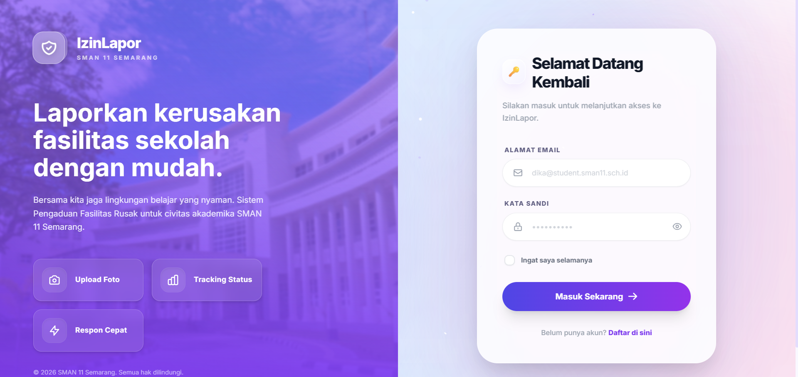
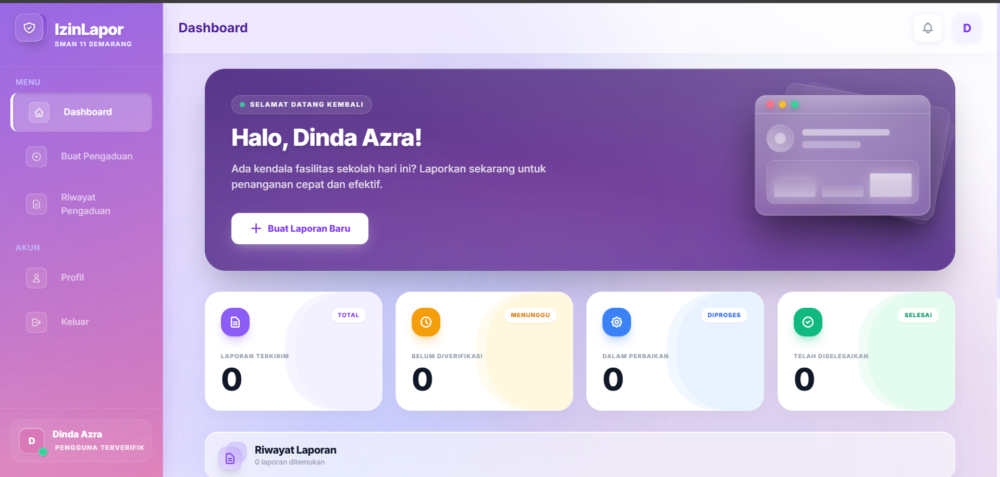

# IzinLapor - Sistem Pengaduan Fasilitas Rusak SMAN 11 Semarang

IzinLapor adalah aplikasi berbasis website untuk pelaporan dan manajemen keluhan fasilitas sekolah. Aplikasi ini dirancang khusus untuk memfasilitasi siswa-siswi SMAN 11 Semarang dalam melaporkan kerusakan infrastruktur secara digital, efisien, dan transparan.

## Fitur Utama

- **Sistem Pelaporan Mandiri:** Siswa dapat memfoto kerusakan, memilih kategori ruang/fasilitas, dan mengirimkan detail kerusakan lengkap beserta lampiran gambar.
- **Transparansi Progres Penanganan:** Pengguna dapat memantau status aktual laporan mereka (mulai dari *Menunggu*, *Diproses*, hingga *Selesai*), lengkap dengan indikator persentase interaktif dan perkiraan target hari selesai.
- **Autentikasi Aman & Spesifik:** Pendaftaran akun dibatasi secara ketat hanya menggunakan domain resmi sekolah (`@student.sman11.sch.id` khusus siswa, dan `@sman11.sch.id` khusus staf pengelola/admin).
- **Dashboard Admin:** Memudahkan tim sarpras sekolah untuk segera merespons aduan, menolak laporan tidak valid, serta memutakhirkan progres persentase perbaikan di lapangan secara bertahap.
- **Notifikasi *Real-Time*:** Terintegrasi langsung untuk seketika memberi tahu pelapor saat ada respons atau jika status laporannya sedang dikerjakan.
- **Desain UI Premium:** Dibangun menggunakan konsep desain antarmuka *Liquid Glass* yang rapi, modern, dengan animasi kartu statistik layaknya aplikasi profesional.

## Teknologi yang Digunakan

Aplikasi ini menggunakan perpaduan (*stack*) teknologi yang modern dan responsif dengan struktur *Single Page Application* (SPA):

- **Tim Backend:** Framework Laravel 12.xx (PHP 8)
- **Tim Frontend:** Vue.js 3 (*Composition API*) dengan jembatan Inertia.js untuk perpindahan halaman tanpa *loading*.
- **Styling Visual:** Tailwind CSS 
- **Database:** PostgreSQL (Lokal via Laragon, Produksi via Supabase)
- **Penyimpanan Gambar (Storage):** Cloudinary API
- **Deployment Server:** Vercel
- **Real-Time Socket:** Konfigurasi Pusher/Reverb 

## Panduan Instalasi (Lokal via Laragon)

Ikuti langkah-langkah di bawah untuk mengatur, menginstal, dan langsung menguji aplikasi ini secara lokal menggunakan **Laragon**:

### Tahap 1: Persiapan Aplikasi
1. Pastikan aplikasi **Laragon** sudah menyala beserta *service* web server (Apache/Nginx) dan PostgreSQL-nya.
2. Salin (*clone*) direktori proyek ini ke komputer Anda, letakkan tepat di dalam folder root Laragon (biasanya di `C:/laragon/www/`).
3. Masuk ke folder aplikasi tersebut, kemudian buka program **Terminal** (bisa menggunakan fitur terminal bawaan Laragon) di folder tersebut.
3. Install seluruh paket dependencies bahasa pemrograman PHP dengan mengetik:
   ```bash
   composer install
   ```
4. Salin file contoh konfigurasi *environment* menjadi file operasional utama:
   ```bash
   copy .env.example .env
   ```
5. Bangkitkan enkripsi utama (Application Key) sistem Laravel:
   ```bash
   php artisan key:generate
   ```

### Tahap 2: Pengaturan Database
1. Buka dan buat sebuah database baru (contoh: `pengaduan-sman11`) pada program database PostgreSQL (contohnya via pgAdmin atau psql).
2. Buka file `.env` hasil langkah nomor 4 di atas menggunakan *code editor*, kemudian cari dan isi koneksi database Anda, misalnya:
   ```env
   DB_CONNECTION=pgsql
   DB_HOST=127.0.0.1
   DB_PORT=5432
   DB_DATABASE=pengaduan-sman11
   DB_USERNAME=postgres
   DB_PASSWORD=
   ```
3. Susun tabel-tabel database sekaligus penuhi dengan data bawaan (*dummy* laporan, data kategori rusak, dll):
   ```bash
   php artisan migrate:fresh --seed
   ```

### Tahap 3: Membangun Antarmuka & Menjalankan Server
1. Download seluruh pustaka JavaScript *frontend* dengan mengetik:
   ```bash
   npm install
   ```
2. Anda harus merender dan menyiagakan (*compile*) komponen tampilannya di latar belakang *Terminal*. **Jangan tutup** terminal setelah menjalankan perintah ini:
   ```bash
   npm run dev
   ```
3. Silakan buka tab Terminal / Command prompt baru (Terminal kedua) lalu jalankan server asli aplikasinya:
   ```bash
   php artisan serve
   ```

Aplikasi siap mengudara! Karena Anda menggunakan Laragon, aplikasi ini juga biasanya otomatis dapat diakses melalui domain virtual yang cantik dari Laragon, contohnya: **`http://pengaduan-sman11.test`**. 

Silakan masuk menggunakan akun buatan dari struktur percobaan dan nikmati eksplorasi aplikasinya!

## Gambaran Deployment (Server Produksi)

Aplikasi ini sudah dipersiapkan dan dioptimalkan agar dapat langsung di-deploy (mengudara) menggunakan konfigurasi arsitektur serverless yang hemat biaya nan modern:
- **Server Aplikasi Frontend & Backend:** Menggunakan layanan [Vercel](https://vercel.com) (Serverless PHP via `vercel-php`).
- **Server Database:** Menggunakan layanan [Supabase](https://supabase.com) (PostgreSQL Database dengan Transaction Pooler).
- **Media File Lampiran Gambar:** Menggunakan integrasi [Cloudinary](https://cloudinary.com) agar gambar-gambar bukti pelaporan yang diunggah aman dan tidak membebani server.

## Tampilan Aplikasi

### Halaman Login

### Dashboard


---
*Didesain dan dikembangkan sebagai lompatan digitalisasi infrastruktur modern untuk kenyamanan sivitas SMAN 11 Semarang.*

**Dibuat oleh Kelompok 38 RPL (Rekayasa Perangkat Lunak)**
